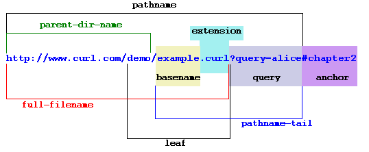

# Bienvenidos

## Autores

### Defossé Nahuel

nahuel.defosse@gmail.com @d3f0

### van Haaster Diego Marcos

diegomvh@gmail.com @diegomvh

## Curso

6 clases teórico-prácticas de 2hs cada clase.

## Certificados y Aprobación

* Es necesario el 80% de asistencia para certificado de asistencia.
* Para lograr la aprobación se debe completar un proyecto y *hostearlo* en la nube.
  *El hosting será provisto por la organización del curso*.

---

# Plataforma

.fx: title

---

# Aplicacion Web?

.fx: centerquote

> Se denomina aplicación web a aquellas herramientas que los usuarios o **clientes** puede utilizar accediendo a un **servidor** a través de un determinado **protocolo**.

---

# Cliente - Browser

* HTML, CSS, Javascript
* Firefox, Chrome, Opera, Explorer

---

# Protocolo - HTTP

HTTP es la forma en que navegador dialoga con el servidor recuperando recursos o enviando información.

Es un protocolo de *texto plano*, donde tanto las peticiones como las respuestas
tienen un encabezado y un cuerpo separado por una línea en blanco.

Los recursos se localizan mediante URLs, que tiene la forma:

    !text
    http://miservidor.com.ar/imagenes/imagen.jpg
    http://localhost:8000/sistema?buscar=pepe&dni=30222111

---

# URLs

Los recursos a los que se puede acceder meidiante uns servidor web deben
estar identificados por una **dirección universal de recurso**, o URL.

Una URL identifica:

* donde (dirección del servidor)
* que recurso (ej: un archivo)
* una consulta y una ubicación en un documento

---

# Métodos HTTP

Cada vez que se envía una consulta, el navegador especifica un método o verbo.
Cuando se piden recursos o se hacen consultas se utiliza el método **GET**.
Cuando se envía información que genera o altera recursos se utiliza el método **POST**.

## Request

    !text
    GET HTTP://www.google.com.ar HTTP/1.1
    Host: www.google.com.ar
    User-Agent: curl/7.29.0
    Accept: */*

## Response

    !text
    HTTP/1.0 200 OK
    Cache-Control: private, max-age=0
    Content-Type: text/html; charset=ISO-8859-1
    Set-Cookie: ....

    <!doctype html><html itemscope=""...

---

# Servidor - Web Server

* Common Gateway Interface
* Apache, Nginx

