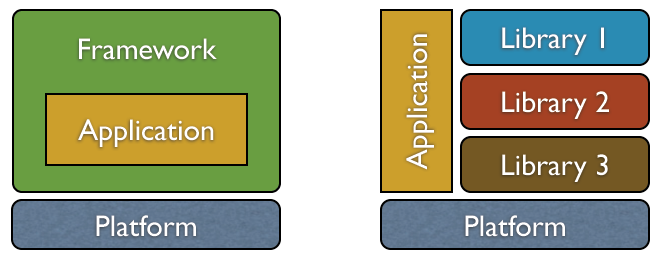
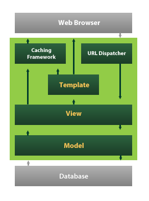
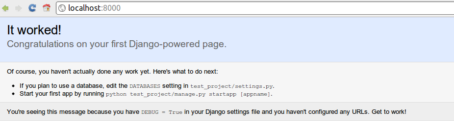

# Django<blockquote>
The Web framework for perfectionists with deadlines
</blockquote>

.fx: title

---

# Django

.fx: smallest

* Django es un framework web en Python de alto nivel que permite un desarrollo rápido y un diseño limpio y pragmático
* Django automatiza todo lo posible adhiriéndose al principio DRY (Don’t Repeat Yourself)
    * Pone énfasis en el re-uso, la conectividad y extensibilidad de componentes
    * Python es usado en todo del framework (archivos, configuraciones, modelos de datos)

## Notas Djangeras

Desarrollado para gestionar varias páginas orientadas a noticias de la World Company de Lawrence, Kansas 
En julio de 2005 fue liberado bajo la licencia BSD; y desde junio de 2008 la Django Software Foundation lleva adelante el proyecto 
Su nombre es en alusión al guitarrista de jazz gitano Django Reinhardt

## Quien usa Django o "notas cholulas"

Google AppEngine, Nasa, Bitbucket.org, Disqus, Instagram, ...

---

# Caracteristicas

* Mapeador de objectos Python a base de datos **ORM**

.notes: Definimos el modelo en Python y obtenemos una rica y dinamica API de acceso a datos

* Aplicaciones "enchufables"

.notes: Listas para usar admin, auth, session, localflavor

* Interfaz de administración automática

.notes: Save yourself the tedious work of creating interfaces for people to add and update content. Django does that automatically, and it's production-ready.

* Sistema de "vistas genéricas"

.notes: Crear, editar, elimniar entidades de la base, listados, paginadores

* Elegante diseño de URLs

.notes: Uso de expresiones regulares para despachar hacia las vistas.

* Sistema de plantillas basado en etiquetas

.notes: Basadas en HTML, con soporte de herencia, inclusion, condicionales, iteraciones.

* Sistema de Cache

.notes: Varios niveles y backends para cachear lo que se necesite de la forma mas flexible.

* Soporte de internacionalización

.notes: El framework ya viene con soporte a varios idiomas.

* Documentación incorporada

.notes: Accesible a través de la aplicación administrativa

---

# Un framework

Un programador utilizar generalmente librerías que están
incluidas en su lenguaje y muchas veces librerías de
externos que proveen funcionalidad adicional a su porgrama.

Un framework brinda el *programa* y tiene un comportamiento
definido que el programdor modifica para adaptarlo a sus
necesidades.

---

# Patron MTV

* Model → modelo de datos (models.py)
* View → vistas de datos (views.py)
* Template → plantillas de páginas (generalmente archivos HTML)

---

# Funcionamiento

.fx: bigbullets

* El usuario pide una URL (por GET ó POST)
* Django busca la primera URL que coincida con la solicitada (urls.py)
* Se ejecuta la vista (función) a la que apunta esa URL (views.py)
* En la vista se utilizan los models (modelos de datos) para consultar la BD
* Los datos resultantes se introducen en la plantilla (templates)
* Se devuleve una respuesta HTTP con el HTML generado

---

# Proyecto

* Un desarrollo es un Proyecto
* Un proyecto puede hacer funcionar varios sitios web
* Un proyecto consta de una o mas aplicaciones

## Crear un proyecto

    !bash
    django-admin.py startproject mysite

## Estructura

    !bash
    mysite/
        manage.py
        mysite/
            __init__.py
            settings.py
            urls.py
            wsgi.py

---

# Servidor de desarrollo

    !bash
    python manage.py runserver

## Abrimos http://localhost:8000

---

# Aplicación

* Dentro del proyecto utilizamos **manage.py** para crear aplicaciones

# Crear una app

    !bash
    python manage.py startapp myapp

## Estructura

    !bash
    mysite/
        manage.py
        myapp/
            __init__.py
            models.py
            views.py
            tests.py
        mysite/
            __init__.py
            settings.py
            urls.py
            wsgi.py
