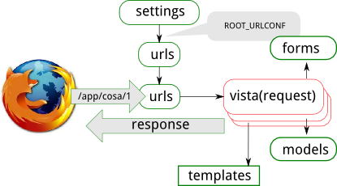
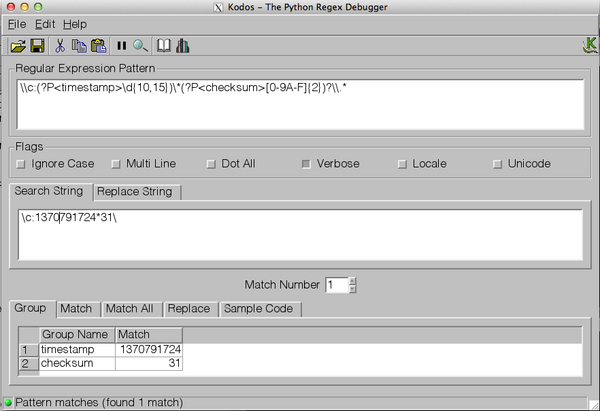

# Vistas

.fx: title

---

# Vistas
Basicamente una vista o view es un "tipo" de página web en nuestra aplicación,
generalmente provee una función específica. Generalmente tiene una plantilla
asociada.

En su forma mas simple una view es una **funcion** en Python que recibe el
**request** como parametro y luego de realizar alguna tarea genera y retorna un
objeto **response**.

---

# Dónde se encuentran

La convensión es guardar las vistas de cada aplicación en un archivo llamado *views.py*

    !bash
    mysite/
        myapp/
            models.py
            views.py

Creamos nuestra primera vista

    !python

    from django.http import HttpResponse

    def index(request, nombre):
        return HttpResponse("Hola %s." % nombre)

> Como se ejecuta la vista?

---

# Mapeo de URLs

En Django el contenido se entrega a partir de views, y el encargado de determinar
qué view se ejecuta es un módulo Python informalmente llamado *URLconfs*.

Estos módulos definen como se mapean las URL (expresiones regulares) a funciones
(las views).

    !bash
    mysite/
        myapp/
            ...
            views.py
            urls.py  <--- Agregamos

En url.py argeamos la tupla que mapea la url en nuestra view

    !python

    from django.conf.urls import patterns, url

    from myapp import views

    urlpatterns = patterns('',
        url(r'^(\w+)$', views.index, name='index')
    )

---

# Incluir URLs

Luego de crear un modulo al nivel de aplicacion el próximo paso es incluirlo
en el URLconf raíz.

    !bash
    mysite/
        myapp
        mysite/
            ...
            settings.py
            urls.py  <---- URLconf raíz

Importamos include

    !python
    from django.conf.urls import patterns, include

    urlpatterns = patterns('',
        url(r'^myapp/', include('myapp.urls')),
        url(r'^admin/', include(admin.site.urls)),
    )

---

# Obteniendo información de la URL

Utilizando expresiones regulares se pueden asociar
partes de la URL a parámetros de la URL.

    !python

    from views import listado_historico

    urlpatterns = patterns('',
        url(r'^listado_historico/(\d{4})-(\d{1,2})(\d{1,2})',
        listado_historico, name='listado_historico'),
    )

y la vista

    !python

    from datetime import date

    def listado_historico(request, anio, mes, dia):
        try:
            fecha = date(int(fecha), int(mes), int(dia))
        except ValueError:
            return HttpResponseRedirect('..')
        Publicaciones.objects.filter(fecha=fecha)
        # Retornar algo útil...

---

# Cómo generar las URLs?

## Kodos

Kodos permite depurar expresiones regulares

